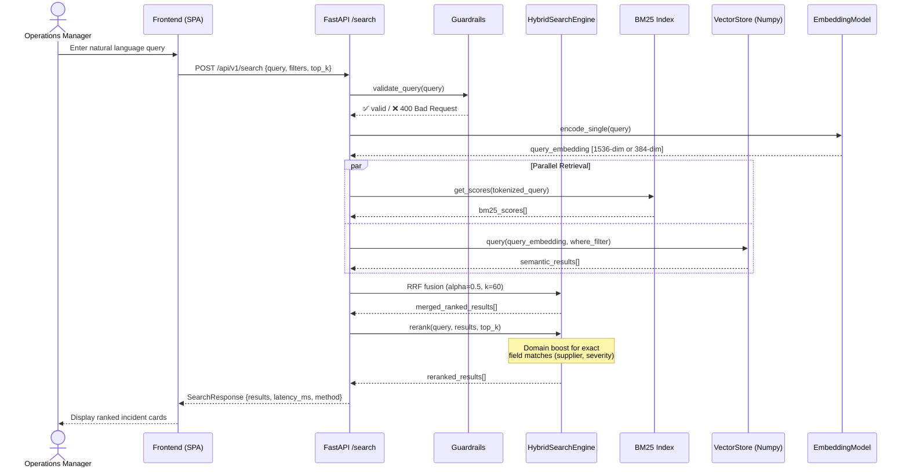
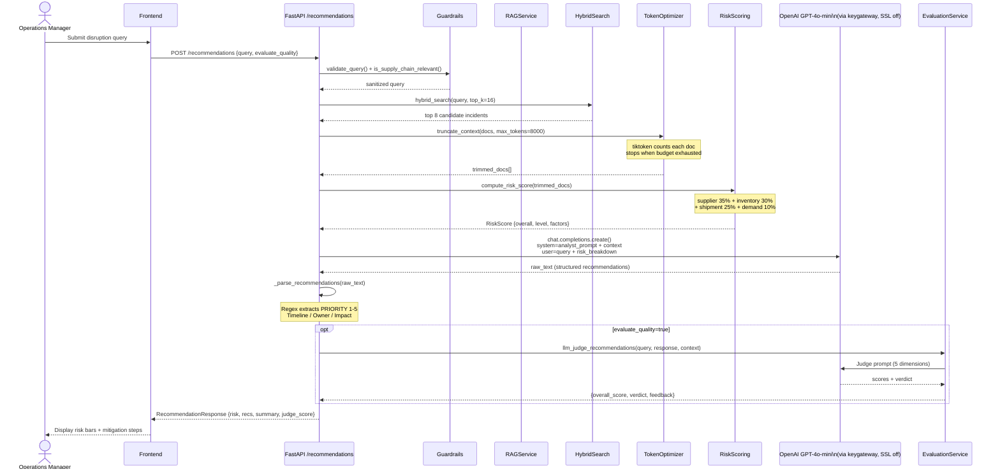
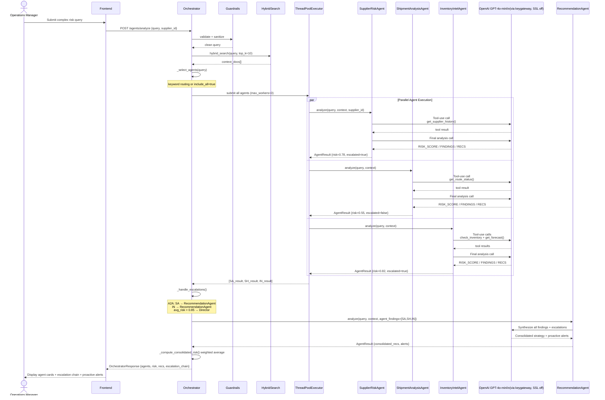
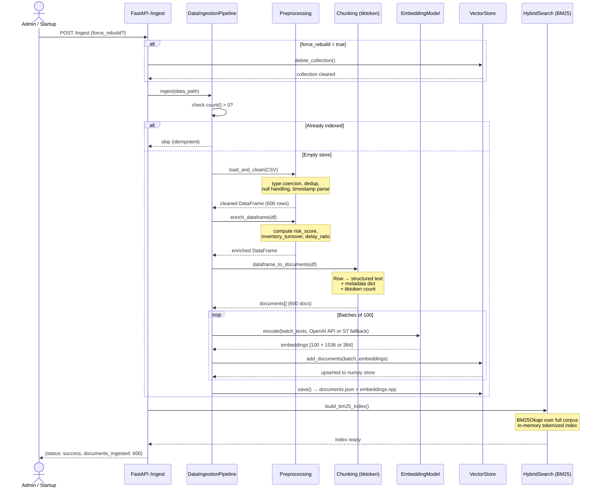
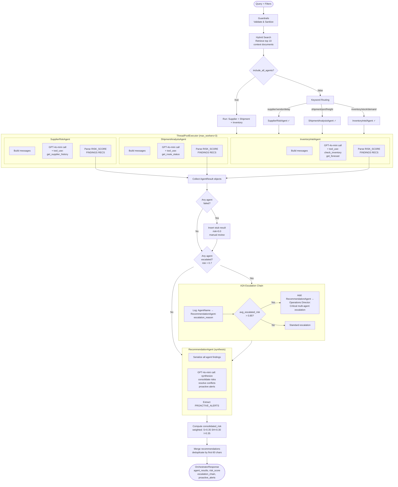

# AI-Powered Supply Chain Risk Intelligence Assistant
**Current Stack:** Python 3.13 · FastAPI 0.136 · GPT-4o-mini · text-embedding-3-small · Pure-NumPy VectorStore · BM25 · IsolationForest
## Sequence Diagrams & Flowcharts

---

## 1. Sequence Diagram — RAG Search Flow



---

## 2. Sequence Diagram — Recommendation Generation Flow



---

## 3. Sequence Diagram — Multi-Agent Orchestration with A2A Escalation



---

## 4. Sequence Diagram — Data Ingestion Pipeline



---

## 5. Flowchart — Complete System Architecture

```mermaid
flowchart TD
    U([👤 Operations Manager]) --> FE[Frontend SPA\nindex.html]

    FE --> |Search Tab| S_EP[POST /api/v1/search]
    FE --> |Recommendations Tab| R_EP[POST /api/v1/recommendations]
    FE --> |Multi-Agent Tab| A_EP[POST /api/v1/agents/analyze]
    FE --> |Dashboard Tab| D_EP[GET /api/v1/analytics/dashboard]
    FE --> |Anomalies Tab| AN_EP[GET /api/v1/analytics/anomalies]

    subgraph API["FastAPI Application Layer"]
        S_EP
        R_EP
        A_EP
        D_EP
        AN_EP
    end

    subgraph GUARD["Guardrails"]
        G1[Length Validation]
        G2[Injection Detection]
        G3[Domain Relevance Score]
    end

    subgraph CORE["Core Services"]
        EM[EmbeddingModel\ntext-embedding-3-small 1536d\n(fallback: all-MiniLM 384d)]
        VS[VectorStore\nPure Numpy + JSON\nCosine similarity + meta filter]
        BM[BM25 Index\nBM25Okapi\nIn-Memory]
        HS[HybridSearch\nRRF Fusion α=0.5]
        TC[TokenOptimizer\ntiktoken cl100k_base]
    end

    subgraph BSVC["Business Services"]
        RS[RiskScoring\n4-dimension weighted]
        AD[AnomalyDetection\nIsolationForest]
        RAG[RAGService\nRetrieve+Generate]
        EV[EvaluationService\nDeepEval + LLM Judge]
    end

    subgraph AGENTS["Multi-Agent System"]
        OR[Orchestrator\nThreadPoolExecutor]
        SA[SupplierRiskAgent]
        SH[ShipmentAnalysisAgent]
        IN[InventoryIntelAgent]
        RA[RecommendationAgent]
        A2A{A2A Escalation\nrisk > 0.7?}
    end

    subgraph LLMBOX["OpenAI GPT-4o-mini\n(via keygateway, SSL off)"]
        LLM[chat.completions.create\nFunction Calling\nSystem + User Prompts]
    end

    subgraph DATA["Data Layer"]
        CSV[(supply_chain_data.csv\n600 incidents)]
        NP[(numpy embeddings\n+ JSON documents)]
    end

    S_EP --> GUARD
    R_EP --> GUARD
    A_EP --> GUARD

    GUARD --> CORE
    CORE --> HS
    HS --> VS
    HS --> BM

    HS --> RAG
    RAG --> TC
    TC --> RS
    RS --> LLM
    LLM --> EV

    A_EP --> OR
    OR --> SA & SH & IN
    SA --> LLM
    SH --> LLM
    IN --> LLM
    SA & SH & IN --> A2A
    A2A --> |escalate| RA
    A2A --> |no escalation| RA
    RA --> LLM

    D_EP --> VS
    AN_EP --> AD
    AD --> VS

    VS --> NP
    CSV --> DATA
```

---

## 6. Flowchart — Hybrid Search Decision Flow

```mermaid
flowchart TD
    START([Query Received]) --> GUARD{Guardrails\nPass?}
    GUARD -->|❌ Blocked| ERR[Return 400 Error]
    GUARD -->|✅ Valid| SAN[Sanitize Query]

    SAN --> FILTER[Build Metadata Filter\nsupplier / severity / status / type]

    FILTER --> PARALLEL

    subgraph PARALLEL["Parallel Retrieval (fetch_k = top_k × 3)"]
        direction LR
        BM25[BM25Okapi\nTokenize query\nget_scores over corpus]
        SEM[Semantic Search\nEncode query → 1536-dim (OpenAI) or 384-dim (fallback)\nCosine similarity ANN]
    end

    BM25 --> RRF
    SEM --> RRF

    subgraph RRF["Reciprocal Rank Fusion"]
        direction TB
        R1[Semantic score: α × 1÷(k+rank_sem)]
        R2[BM25 score: (1-α) × 1÷(k+rank_bm25)]
        R3[Sum RRF scores per document]
        R1 --> R3
        R2 --> R3
    end

    RRF --> SORT[Sort by RRF score descending\nSlice top_k results]

    SORT --> RERANK

    subgraph RERANK["Logistics-Aware Reranker"]
        RK1[Check query for exact field matches]
        RK2[+0.05 boost per matching field:\nincident_type, severity,\nwarehouse, supplier, product]
        RK3[Re-sort by rerank_score]
        RK1 --> RK2 --> RK3
    end

    RERANK --> OUT([Ranked Incident Results])
```

---

## 7. Flowchart — Risk Scoring Logic

```mermaid
flowchart TD
    IN([Retrieved Incidents\nList of Documents]) --> EMPTY{Documents\nempty?}
    EMPTY -->|Yes| ZERO[Return zero risk\nLOW level]

    EMPTY -->|No| EXTRACT[Extract features per document:\ndelivery_delay, inventory_level,\ntransportation_cost, shipment_status,\nseverity]

    EXTRACT --> STATS[Compute aggregates:\navg_delay, avg_inventory,\navg_cost, delay_ratio,\ncritical_count, high_count]

    STATS --> SUPPLIER

    subgraph SUPPLIER["Supplier Risk (weight 35%)"]
        S1{avg_delay}
        S1 -->|> 14 days| SR1[0.90]
        S1 -->|> 7 days| SR2[0.65]
        S1 -->|> 3 days| SR3[0.40]
        S1 -->|≤ 3 days| SR4[0.15]
    end

    STATS --> INVENTORY

    subgraph INVENTORY["Inventory Risk (weight 30%)"]
        I1{avg_inventory\nunits}
        I1 -->|< 50| IR1[0.95]
        I1 -->|< 150| IR2[0.70]
        I1 -->|< 300| IR3[0.40]
        I1 -->|≥ 300| IR4[0.15]
    end

    STATS --> SHIPMENT

    subgraph SHIPMENT["Shipment Risk (weight 25%)"]
        SH1{delayed_ratio}
        SH1 -->|> 60%| SHR1[0.85]
        SH1 -->|> 30%| SHR2[0.55]
        SH1 -->|≤ 30%| SHR3[0.20]
    end

    STATS --> DEMAND

    subgraph DEMAND["Demand Risk (weight 10%)"]
        D1{avg_cost USD}
        D1 -->|> $3000| DR1[0.70]
        D1 -->|> $2000| DR2[0.45]
        D1 -->|≤ $2000| DR3[0.20]
    end

    SR1 & IR1 & SHR1 & DR1 --> WEIGHTED
    SR2 & IR2 & SHR2 & DR2 --> WEIGHTED
    SR3 & IR3 & SHR3 & DR3 --> WEIGHTED
    SR4 & IR4 & SHR3 & DR3 --> WEIGHTED

    subgraph WEIGHTED["Weighted Combination"]
        W1["overall = (supplier×0.35 + inventory×0.30\n+ shipment×0.25 + demand×0.10)"]
    end

    WEIGHTED --> MULT{critical_count > 0?}
    MULT -->|Yes| MX1[× 1.2]
    MULT -->|No| MULT2{high_count > 1?}
    MULT2 -->|Yes| MX2[× 1.1]
    MULT2 -->|No| CLAMP

    MX1 --> CLAMP[min(score, 1.0)]
    MX2 --> CLAMP

    CLAMP --> LEVEL{Threshold}
    LEVEL -->|≥ 0.75| C1[🔴 CRITICAL]
    LEVEL -->|≥ 0.50| C2[🟠 HIGH]
    LEVEL -->|≥ 0.25| C3[🟡 MEDIUM]
    LEVEL -->|< 0.25| C4[🟢 LOW]

    C1 & C2 & C3 & C4 --> OUT([RiskScore Object\n+ risk_factors list])
```

---

## 8. Flowchart — Multi-Agent Orchestration & A2A Escalation



---

## 9. Flowchart — Anomaly Detection Pipeline

```mermaid
flowchart TD
    START([GET /analytics/anomalies\ncontamination=0.05]) --> LOAD[Load all documents\nfrom VectorStore]

    LOAD --> CHECK{Count ≥ 10?}
    CHECK -->|No| INSUF[Return: insufficient data]

    CHECK -->|Yes| FEAT[Extract 5 numeric features\nper document:\ndelivery_delay\ninventory_level\ntransportation_cost\norder_quantity\ndemand_forecast]

    FEAT --> SCALE[StandardScaler\nnormalize to zero mean\nunit variance]

    SCALE --> ISO[IsolationForest\nn_estimators=100\ncontamination=configurable\nrandom_state=42]

    ISO --> PRED[fit_predict → labels\nscore_samples → anomaly_scores]

    PRED --> FILTER[Filter: label == -1\nanomalous records]

    FILTER --> ATTR[Feature Attribution\nper anomaly:\ncompute Z-score per feature\nflag if Z > 2.5]

    ATTR --> DESC[Generate description:\nwarehouse + supplier + features]

    DESC --> SORT[Sort by anomaly_score\ndescending]

    SORT --> CORR

    subgraph CORR["Correlation Analysis (whole dataset)"]
        C1[Pearson correlation matrix]
        C2{delay↔cost\n|r| > 0.30?}
        C3{inventory↔delay\n|r| > 0.20?}
        C4{demand↔cost\n|r| > 0.25?}
        C5{high_delay_%\n> 20%?}
        C6{low_inv_%\n> 15%?}
    end

    CORR --> INSIGHTS[Collect correlation insights]
    INSIGHTS --> OUT([AnomalyResponse\ntotal_anomalies\nanomalies top-20\ncorrelation_insights])
```
